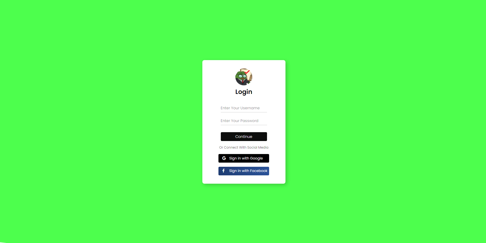
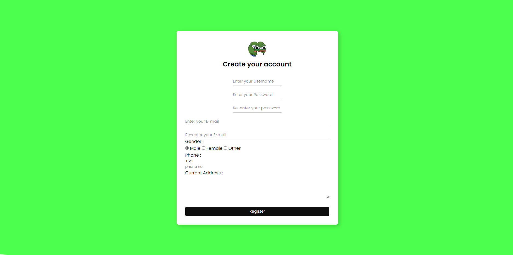

# Atividade-1

Atividade simples e responsiva de login e registro feito com HTML e CSS.

### Resultados Finais

## Começando
Para começar o projeto é só abrir o arquivo "index.html" e "registering.html" no seu browser de preferência.
